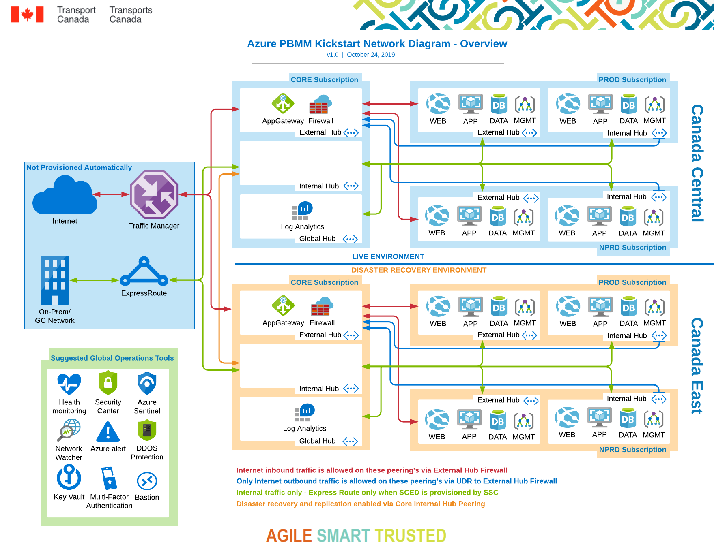
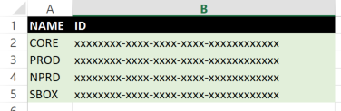

([Français](#gc-fr))

# TC Azure Template Generator

**A kickstart for your PBMM Cloud!**

**_NOTICE_**: _This is a work in progress and no waranty or guarantee is provided or implied. You will need to complete additional tasks in order to completely satisfy PBMM requirements and security controls.

_More complete documentation is "COMING SOON"!

This solution gives users the ability to manage most network infrastructure settings and configurations from excel. This project comes pre-prepared with an entire sample network infrastructure, including Disaster Recovery region with **Core, Prod and Non Prod Subscriptions**, which can be used or modified to suit your needs.

Running the **AzureTemplateGenerator.ps1** script it will parse the excel file and generate all of the following for a brand new **Enterprise level PBMM Network Infrastructure** in Azure.

Currently generates:

* **Policies** (recommended policies inc. GoC PBMM)
* **Log Analytics Workspaces** (where all logs are accumulated for monitoring, fully applied to all networking resources for full logging OOB)
* **Resource Groups** (with policies assigned)
* **Network Security Groups** (fully configured with sample rules)
* **Route Tables** (with typical routing assigned)
* **Virtual Networks** (including peering)
* **Application Gateway** (with very basic configuration)
* **Azure Firewall** (preconfigured with several sample rules)
* **Storage Accounts** (for operations usage)
* **Recovery Service Vaults** (configured for both Azure Site Recovery and Backups)

Coming Soon:
* **Bastion Hosts**
* **Key Vaults**
* **DDOS**
* **VM Templates with hardened DSC configurations**
* **CICD Pipeline Samples**

## What do I do with this?

First off you will need to either create the azure subscriptions you see in the **"SUB"** worksheet and enter the corresponding IDs into the fields provided **OR** you will need to modify the entire sheet to suit the subscriptions you wish to use. 

Once you execute the generator you will find a new folder called **"ARM"** in your directory with several folders and files inside. At the root of this folder you will find a new script called **"RUN-Full-Deploy-INF.ps1"**. 

If you choose to execute this script it will execute, in order, all scripts and deploy all resources. This WILL take some time as certain resources, such as application gateways, take a fair number of minutes to provision.

Alternatively, upload all the generated templates and PS scripts to a DevOps repo and set up your own CICD build and release pipelines to manage your ongoing operations.

## License

Unless otherwise noted, the source code of this project is covered under Crown Copyright, Government of Canada, and is distributed under the [MIT License](LICENSE).

The Canada wordmark and related graphics associated with this distribution are protected under trademark law and copyright law. No permission is granted to use them outside the parameters of the Government of Canada's corporate identity program. For more information, see [Federal identity requirements](https://www.canada.ca/en/treasury-board-secretariat/topics/government-communications/federal-identity-requirements.html).

______________________
![#gc-fr]
# TC Générateur de modèles Azure

Un kickstart pour votre cloud PBMM!

Cette solution permet aux utilisateurs de gérer la plupart des paramètres d’infrastructure réseau et des configurations d’Excel. Lorsque vous exécutez le script AzureTemplateGenerator.ps1, le fichier Excel est analysé et toutes les informations suivantes sont générées pour une toute nouvelle infrastructure réseau PBMM de niveau entreprise dans Azure.

Ce projet est livré pré-préparé avec un exemple d'infrastructure réseau complet, avec des abonnements Core, Prod et Non Prod, qui peuvent être utilisés ou modifiés pour répondre à vos besoins.

Il fournit:

* **Politiques** (politiques recommandées inc. GdC PBMM)
* **Log Analytics Workspaces** (où tous les journaux sont accumulés pour la surveillance, entièrement appliqués à toutes les ressources réseau pour une journalisation complète OOB)
* **Groupes de ressources** (avec stratégies assignées)
* **Groupes de sécurité réseau** (entièrement configurés avec des exemples de règles)
* **Tables de routage** (avec routage typique attribué)
* **Réseaux virtuels** (y compris le peering)
* **Application Gateway** (avec configuration très basique)
* **Pare-feu Azure** (préconfiguré avec plusieurs exemples de règles)
* **Comptes de stockage** (pour l'utilisation des opérations)
* **Coffres-forts du service de récupération** (configurés pour Azure Site Recovery et les sauvegardes)

Bientôt disponible:

* **Hôtes Bastion**
* **Coffres à clés**
* **DDOS**
* **Modèles de machine virtuelle avec configurations DSC renforcées**
* **Échantillons de pipeline CICD**

## Qu'est-ce que je fais avec ça?

Une fois que vous avez exécuté le générateur, vous trouverez un nouveau dossier appelé "ARM" dans votre répertoire avec plusieurs dossiers et fichiers. À la racine de ce dossier, vous trouverez un nouveau script appelé "RUN-Full-Deploy-INF.ps1".

Si vous choisissez d'exécuter ce script, il exécutera, dans l'ordre, tous les scripts et déploiera toutes les ressources. Cela prendra un certain temps, car certaines ressources, telles que les passerelles d’application, prennent un bon nombre de minutes à mettre en service.

Si vous préférez, vous pouvez plutôt prendre tous les modèles et scripts PS, les télécharger sur un référentiel DevOps et configurer votre propre pipeline CICD de génération et de version pour gérer vos opérations en cours.

## Comment contribuer

Voir [CONTRIBUTING.md](CONTRIBUTING.md)

## Licence

Sauf indication contraire, le code source de ce projet est protégé par le droit d'auteur de la Couronne du gouvernement du Canada et distribué sous la [licence MIT](LICENSE).

Le mot-symbole « Canada » et les éléments graphiques connexes liés à cette distribution sont protégés en vertu des lois portant sur les marques de commerce et le droit d'auteur. Aucune autorisation n'est accordée pour leur utilisation à l'extérieur des paramètres du programme de coordination de l'image de marque du gouvernement du Canada. Pour obtenir davantage de renseignements à ce sujet, veuillez consulter les [Exigences pour l'image de marque](https://www.canada.ca/fr/secretariat-conseil-tresor/sujets/communications-gouvernementales/exigences-image-marque.html).
