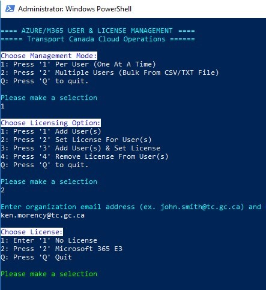

# TC Cloud Team Automation & Scripting Tools

Transport Canada Cloud Operations Automation Tools &amp; Scripts


## AZURE SCRIPTS

**Required Module(s):**

Install the 64-bit version of the Microsoft Online Services Sign-in Assistant: Microsoft Online Services Sign-in Assistant for IT Professionals RTW: 
- https://www.microsoft.com/en-us/download/details.aspx?id=41950

**Install the Microsoft Azure Active Directory Module for Windows PowerShell with these steps:**
- Open an elevated Windows PowerShell command prompt (run Windows PowerShell as an administrator).
- Run the **Install-Module MSOnline** command.
- If prompted to install the NuGet provider, type Y and press ENTER.
- If prompted to install the module from PSGallery, type Y and press ENTER.

---------------------------------------------------------

### AzureM365UserManagement.ps1
Enables Administrators to connect to M365 and manage add users as well as assign licenses. This script also supports bulk additions/assignments via csv/txt file. Sample CSV included in project.



**Configuration:**
```
$app_title="==== AZURE/M365 USER & LICENSE MANAGEMENT ===="
$dep_title="===== YOUR CUSTOM TITLE HERE ======"
$depart_email="@ORGANIZATION.EMAILDOMAIN.HERE"    #Set your internal domain
$devops_email="@M365.EMAILDOMAIN.HERE"            #Set your the email domain for M365 (if the same as internal, enter the same)
$user_tmppwd = "PUT TEMP PWD HERE"                #Set the temporary password for new user account here
```
```
**Customization:**
$title_color = @{ForegroundColor = "cyan"}
$option_color = @{ForegroundColor="blue"; BackgroundColor="white"}
$success_color = @{ForegroundColor = "green"}
$select_color = @{ForegroundColor = "cyan"}
$error_color = @{ForegroundColor = "red"}
```

**Menu Tree:**
- Per User (One At A Time)
  - Add User(s)
  - Set License For User(s)
  - Add User(s) & Set License
  - Remove License From User(s)
 - Multiple Users (Bulk From CSV/TXT File)
   - Add Users
   - Set License For Users
   - Set License For Users Individually
   - Add Users & Set Licenses
   - Add Users & Set Licenses Individually

**Shown License Options:**
- No License
- Microsoft 365 E3

**Hidden License Options:**
- STREAM
- ENTERPRISEPACKWITHOUTPROPLUS
- DYN365_ENTERPRISE_CASE_MANAGEMENT
- DYN365_TEAM_MEMBERS
- ENTERPRISEPACK
- PROJECTESSENTIALS
- FLOW_FREE
- PROJECTPREMIUM
- Win10_VDA_E3
- FORMS_PRO
- POWERAPPS_VIRAL
- DYN365_ENTERPRISE_P1_IW
- MS_TEAMS_IW
- DYN365_ENTERPRISE_PLAN1
- POWER_BI_STANDARD
- OFFICESUBSCRIPTION
- EMS
- PROJECTPROFESSIONAL
- TEAMS_COMMERCIAL_TRIAL
- ATP_ENTERPRISE

**TODO**
- Refactor code
- Add support for more MSOL account features
- Command line arguments for silent running

